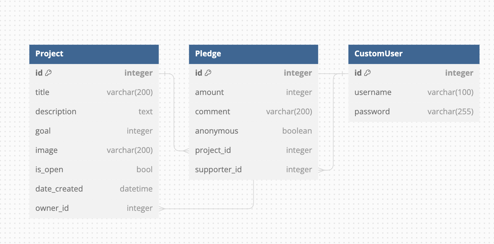
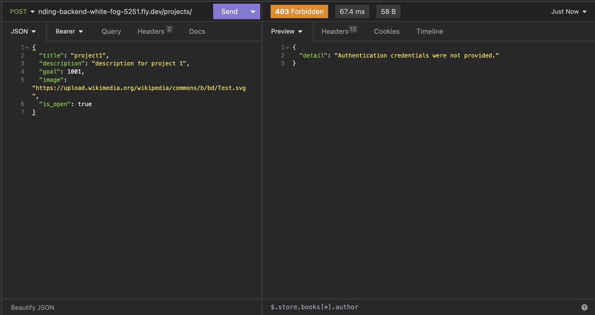

# Crowdfunding Back End

**Suan Choi**

## Planning:

### Concept/Name
::Hackeraiser::
Your friendly hub for supporting innovative and fun tech ideas/projects. Hackeraiser helps creators make the world a better place, one project at a time.

### Intended Audience/User Stories
- Developers
  - Great opportunity to discover / to be a part of a compelling project.
- Tech enthusiast
  - Exciting discoveries and active participation
- Innovator
  - Supportive community for groundbreaking ideas
- Business owner
  - Exploring and investing in tech innovation

### Front End Pages/Functionality

- A page on the front end
  - A list of dot-points showing functionality available on this page
  - etc
  - etc

- A second page available on the front end
  - Another list of dot-points showing functionality
  - etc

### API Spec

Fill out the table below to define your endpoints. An example of what this might look like is shown at the bottom of the page. It might look messy here in the PDF, but once it's rendered, it looks very neat! It can be helpful to keep the markdown preview open in VS Code so that you can see what you're typing more easily.

| URL | HTTP Method | Purpose | Request Body | Success Response Code | Authentication/Authorisation |
| --- | ------ | ----------------------- | ------------ | ------- | ---------- |
| /projects/ |  GET  | Returns the list of Project objects. | n/a | 200 | Not Required |
| /projects/ | POST | Creates a new project | Project object(without id or date_created) | 200 | Login Required |
| /projects/?is_open=True | GET | Returns the list of project with the given status for is_open | n/a | 200 | Not Required |
| /projects/1     | GET | Returns the project detail of requested id with pledges | n/a | 200 | Not Required  |
| /projects/1     | PUT | Updates the project detail of requested id | Project objects(without id or date_created) | 200 | Login Required  |
| /pledges/    | GET | Returns the list of Pledges list | n/a | 200  | Not Required |
| /pledges/    | POST | Creates a new pledge | Pledge object | 200  | Login Required |
| /pledges/1    | POST | Returns the pledge detail of requested id | n/a | 200  | Login Required |
| /users/    | GET | Returns the list of Users | n/a | 200  | Login Required - only super user is permitted to view |
| /users/    | POST | Creates a new user | Username and password | 200  | Not Required |
| /api-token-auth/    | POST | Returns authentication token | User object | 200  |  |

#### How to register a new user

- Navigate to https://crowdfunding-backend-white-fog-5251.fly.dev/users/
- Enter username and password in JSON format
  - e.g. {"username": "admin", "password": "password"}
- Click POST
- Log in as a new user 

### Objects

|    |  |
|-------------|-------------|
| Project | {   "title":"test",  "description":"test",  "goal":9001,  "image":"https://upload.wikimedia.org/wikipedia/commons/b/bd/Test.svg",  "is_open":true  } |
| Pledge  | {   "amount":1,   "comment":"test",   "anonymous":false,   "project":3  } |
| User | { "username":"admin", "password":"password" }

### DB Schema

### Screenshots

